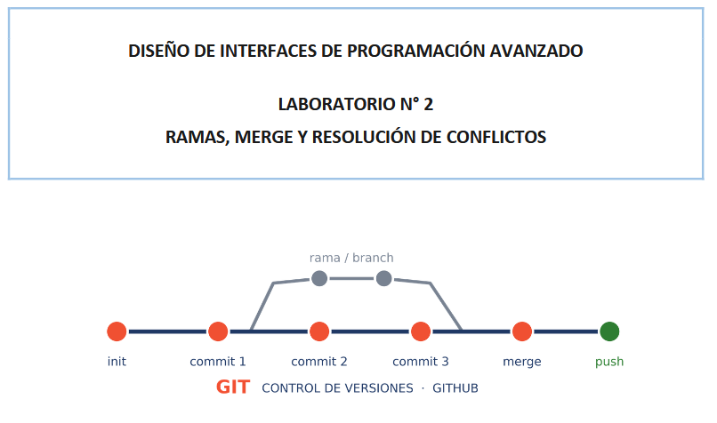

# Guia para compañeros

Curso Diseno de Interfaces de Programacion Avanzado.

## Paso a Paso

Guia elaborada por su compañero

## Contenido

### Trabajo del LAB02

## Requisitos previos:

- Git instalado y funcionando
- Visual Studio Code instalado
- Cuenta en GitHub (la necesitarás recién en la tarea).

## Tema: Flujo con ramas publicado en GitHub

1. Preparar el proyecto y el primer commit
2. Tu primera rama y un merge sin conflicto
3. Provocar un conflicto a propósito

## Mi avance de la guia

- [x] Preparar el proyecto y el primer commit
- [x] Tu primera rama y un merge sin conflicto
- [ ] Provocar un conflicto a propósito

## Comandos que mas uso

| Comando    | Que hace                   |
| ---------- | -------------------------- |
| git add    | Prepara los cambios        |
| git commit | Guarda la version          |
| git push   | Sube los cambios al remoto |

```bash
git add .
git commit -m "Actualiza el README"
git push origin main
```

## Enlace

- [Mi perfil de GitHub](https://github.com/sebastianmr-eng)

## Imagen


